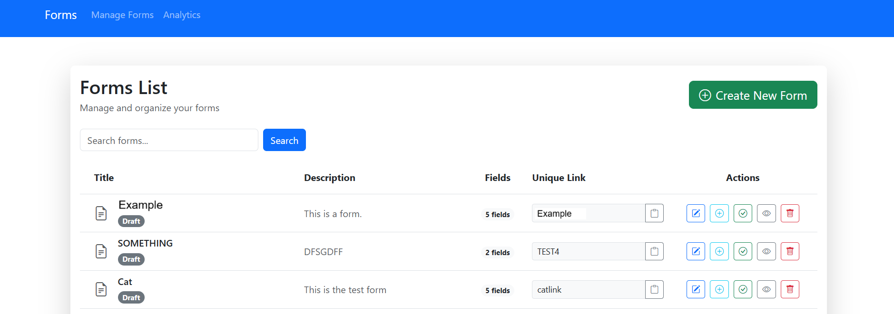
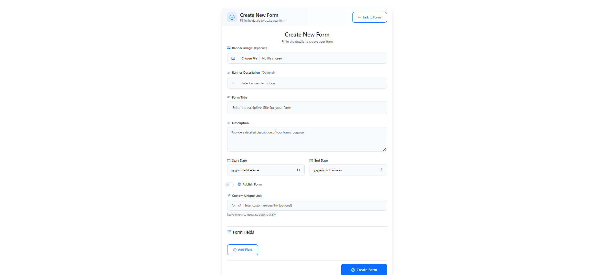
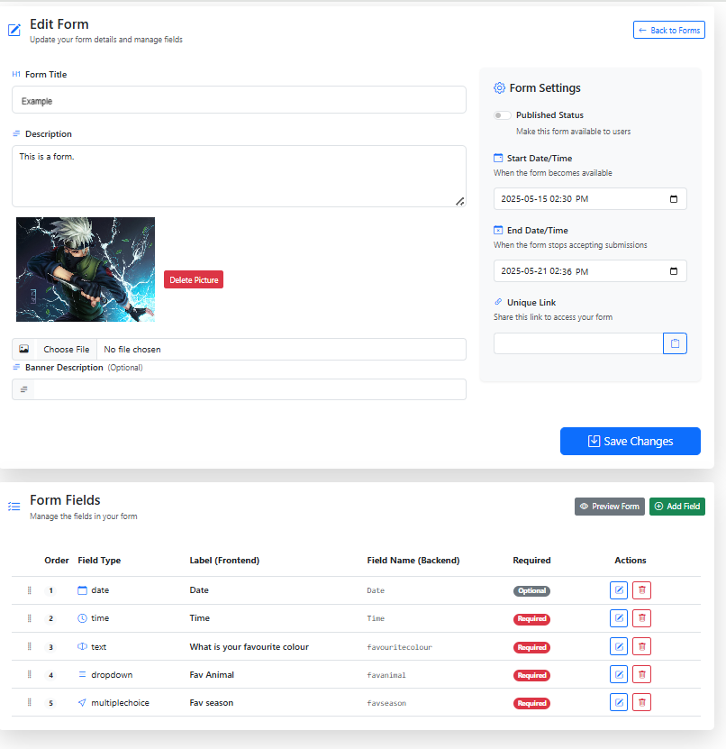
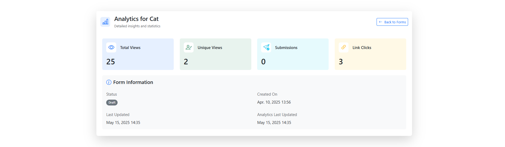

# Forms Web Application

A modern web application for managing and processing forms, built with ASP.NET Core.

## Features

- Secure form submission and processing
- Email notifications
- User authentication and authorization
- Responsive design
- SMTP email integration
- Azure AD integration

## Prerequisites

- .NET 8.0 SDK or later
- SQL Server
- SMTP server access
- Azure AD account (for authentication)

## Getting Started

1. Clone the repository:
   ```bash
   git clone [repository-url]
   cd Forms-web-app
   ```

2. Configure the application:
   - Copy `appsettings.Example.json` to `appsettings.json`
   - Update the following settings in `appsettings.json`:
     - Database connection string
     - SMTP settings
     - Azure AD configuration
     - Owner email

3. Install dependencies:
   ```bash
   dotnet restore
   ```

4. Run database migrations:
   ```bash
   dotnet ef database update
   ```

5. Start the application:
   ```bash
   dotnet run
   ```

The application will be available at:
- HTTP: http://localhost:5000
- HTTPS: https://localhost:5001

## Configuration

### Database Connection
Update the `ConnectionStrings.DefaultConnection` in `appsettings.json` with your SQL Server details:
```json
"ConnectionStrings": {
    "DefaultConnection": "Data Source=YOUR_SERVER;Initial Catalog=YOUR_DATABASE;Integrated Security=True;"
}
```

### SMTP Settings
Configure your email settings in `appsettings.json`:
```json
"SmtpSettings": {
    "Host": "smtp.example.com",
    "Port": 587,
    "Username": "your-email@example.com",
    "Password": "your-password",
    "FromEmail": "your-email@example.com",
    "FromName": "Your Name"
}
```

### Azure AD Configuration
Set up Azure AD authentication by updating the `appConfiguration` section:
```json
"appConfiguration": {
    "ClientId": "your-client-id",
    "ClientSecret": "your-client-secret",
    "TenantId": "your-tenant-id"
}
```

## Development

### Project Structure
- `Controllers/` - API endpoints and form processing logic
- `Models/` - Data models and entities
- `Services/` - Business logic and external service integrations
- `Views/` - UI components and templates
- `wwwroot/` - Static files (CSS, JavaScript, images)

### Running Tests
```bash
dotnet test
```

## Deployment

1. Build the application:
```bash
dotnet publish -c Release
```

2. Deploy the published files to your web server

3. Configure environment variables and connection strings on your hosting platform

## Security

- All sensitive information should be stored in environment variables or secure configuration
- HTTPS is enforced for all communications
- Azure AD authentication is required for access
- SMTP credentials are encrypted

## Contributing

1. Fork the repository
2. Create a feature branch
3. Commit your changes
4. Push to the branch
5. Create a Pull Request


## Screenshots

### Home Page
This screenshot shows the dashboard where you can select a form for analytics, view form statistics, and create new forms.


### Create Form
This screenshot displays the form creation page, where users can enter details, set dates, and add fields to a new form.


### Edit Form
This screenshot shows the edit form interface, allowing users to update form details, manage fields, and configure form settings.


### Analytics
This screenshot presents the analytics dashboard for a specific form, showing total views, unique views, submissions, and link clicks.


### Analytics View
This screenshot provides a detailed view of analytics for a form, including form information, status, and last updated times.
 
